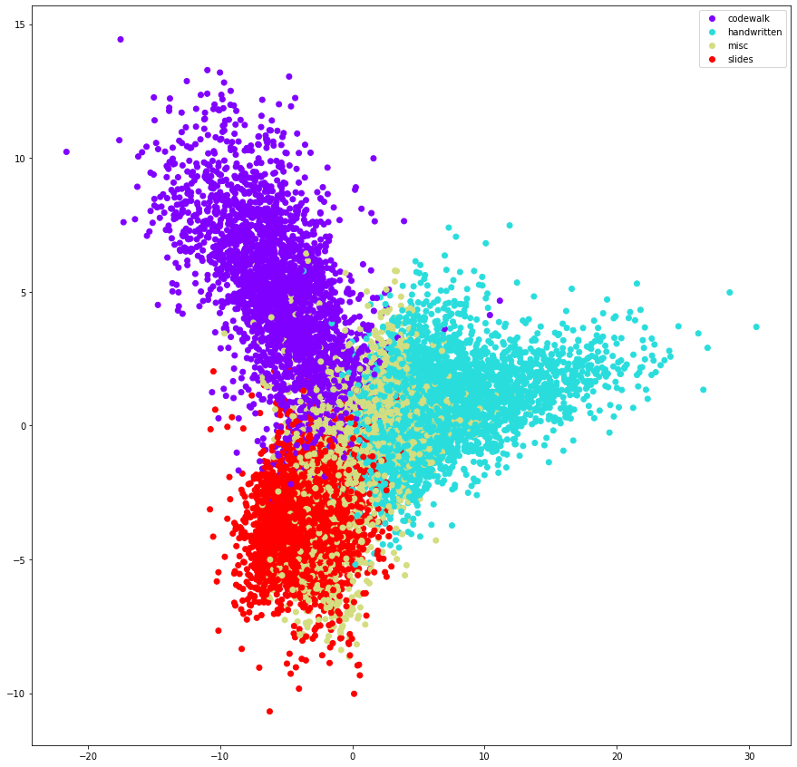

# Video Frame Classification

## Installation
Follow VideoFrameClassification.ipynb for a walkthrough of the entire problem statement

## Considerations

- **Network:** ResNet 18 was chosen. Simpler architectures like VGG-16 requires 6x the number of parameters in ResNet18 and requires more number of operations. The given problem statement doesn't require deeper architectures like ResNet-52, 102 or 152. An experiment with ResNet52 gives approximately the same accuracy on the test set.

- **Split Ratio:** 80% of the entire dataset in the train set and 20% in the test set. 10% of the train set was isolated for the validation set.

- **Data Augmentation:** Resizing to 224x224, random rotation, horizontal flipping, random cropping and normalizing w.r.t ImageNet means and std dev.

- **Architecture Settings:**
	- **Network:** ResNet18
	- **Transfer Learning** from weights pretrained on ImageNet
	- **Batch Size:** 64
	- **Learning Rate:** 1e-3 
	- **Learning Rate Scheduler:** OneCycleLR
	- **Optimizer:** Adam
	- **Loss Criterion:** Cross Entropy Loss

## Results

- After epoch 5, we achieve a training loss of 0.457, **training accuracy of 80.32%**. We obtain a validation loss of 0.496 and **validation accuracy of 79.28%**. Further training leads to overfitting with a large divergence between training and validation accuracies.

- Using the weights from epoch 5, we obtain a test loss of 0.508 and **test accuracy of 79.25%**. (ResNet50 gave 80.04%)

## Plots

### Finding Learning Rate

### Confusion Matrix

### PCA Plot

